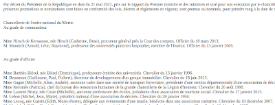
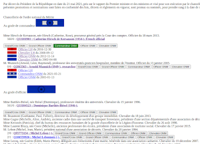

# decret-decoration-wikidata
Import tool from official list of awarded French national decorations to Wikidata

### Qu'est-ce que decret-decoration-wikidata ?
decret-decoration-wikidata est un outil d'importation qui facilite le renseignement des décorations françaises (Légion d'honneur et Ordre National du Mérite) sur wikidata à partir du décret de nomination.

Il permet d'afficher sur une copie locale du décret :
* Les personnes existantes sur wikidata qui sont susceptibles de correspondre aux personnes listées dans le décret.
* Des boutons pour ajouter sur wikidata (via QuickStatement) la décoration attribuée par le décret.

 ==> 

---

### Utilisation
* Installez Python3.
* Téléchargez decret-decoration-wikidata (bouton vert "Code" en haut à droite et "Download ZIP") et dézippez-le.
* Téléchargez la page du décret à traiter (Par exemple [https://www.legifrance.gouv.fr/jorf/id/JORFTEXT000043522969]) et enregistrer cette page dans le même dossier que decret-decoration-wikidata.
* Ouvrez un terminal (invite de commande) dans le dossier (Par exemple ``cd C:/xxx/xxx``).
* Lancez le programme avec la commande ``python3 decret-decoration-wikidata``.
* Renseignez les quelques questions demandées.
* Attendez...(compter ~20 minutes pour 1000 personnes).
* Ouvrez out.html : les personnes déjà listées sur wikidata sont apparues.
* Si une décoration n'est pas encore renseignée sur wikidata (<b>attention aux homonymes !!</b>), cliquez sur le bouton correspondant.
* Allez tout en bas du fichier out.html pour récupérer le texte qui sera à importer dans QuickStatements (outil d'import rapide pour wikidata).

---

### Bug
Vous pouvez signaler les bugs dans l'onglet Issue ou me laisser un message sur ma page wikidata [https://www.wikidata.org/wiki/User:Sovxx]
